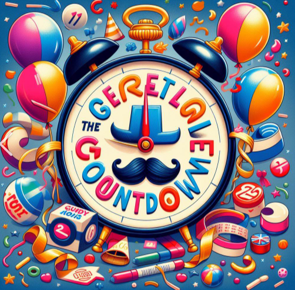
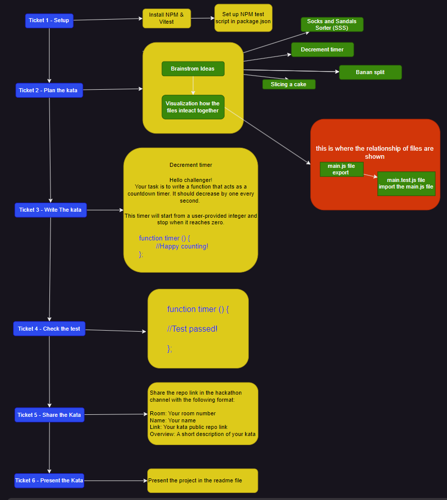

 


# Decrement timer kata
  This is a School of Code Challenge for bootcampers to create their own kata. 
  This kata challenge will help the user to schedule and manage their time efficiently.  

## Table of Content 
- [The_Story_Behind](#The_Story_Behind)
- [Installation](#Installation)
- [Configuration](#Configuration)
- [Planning](#Planning)
- [Instruction_Kata](#Instruction_Kata)
- [Feedback](#Feedback)
- [License](#License)

## The_Story_Behind
**The Case of the Broken Giggle Timer**

In the whimsical village of Chuckleville, time didn’t just tick—it giggled. The Giggle Timer, a peculiar clock, hung in the town square. Its oversized grin-shaped hands counted down not to zero, but to fits of laughter. People gathered daily, waiting for the magical chortle hour.





The Giggle Timer had its uses. It cured Monday blues, turned dentist appointments into comedy shows, and even made traffic jams bearable. But one fateful morning, disaster struck. The timer malfunctioned. Instead of giggles, it emitted a mournful groan. The townspeople gasped. Their laughter reserves were running low, and panic spread like spilled confetti.

Desperate, Mayor Chucklebottom summoned the legendary Kata Warriors—the masters of absurdity. Clad in rainbow capes, they inspected the broken timer. Sensei Chuckleberry scratched his chin. “Ah,” he said. “Classic giggle hiccupitis. We need a synchronized chicken dance.”

And so, the townspeople flapped their arms, clucked, and wiggled. The Giggle Timer shuddered, then—pop!—it spat out belly laughs. Chuckleville rejoiced. The Kata Warriors bowed dramatically. But there was a twist: the timer now counted down to snorts. And that’s how Chuckleville learned that laughter, even in snort form, was the glue that held their quirky community together.

_Note_: If you ever visit Chuckleville, don’t forget your chicken dance moves! 😄🕐


## Installation 
 _Clone this repository first, then proceed to package installation and configuration._ 

### Packages and Frameworks installed 
1. __Node Package Manager__
2. __Vitest__

__To install Node.js and npm:__ 
Make sure you have Node.js and npm installed on your machine. You can download and install them from https://nodejs.org/.

__Install dependencies:__ Run the following command to install the project dependencies:

- Vitest and Package json

```
npm install
npm i -D vitest
```
__Start the vitest:__ Run the following command to start the development server:
```
npm run test
```
Explore more about Vitest and its features in the official documentation: Vitest Documentation. 

## Configuration

__Vistest Configuration File:__

In the package.json file in the root of the project. Change the script and add the following code:

```
"scripts": {
    "test": "vitest",
}
```

## Planning
 As we do the planning for the project we focused on tackling one ticket at a time.




## Instruction_Kata

Hello challenger!
Your task is to write a function that acts as a countdown timer. 
It should decrease by one every second. 

This timer will start from a user-provided integer and stop when it reaches zero.
Only positive numbers are accepted.

## Feedback

Click this [form](https://hackathon-kata-feedback.netlify.app/) for feedback and questions.

## License
[](https://opensource.org/licenses/MIT) .
